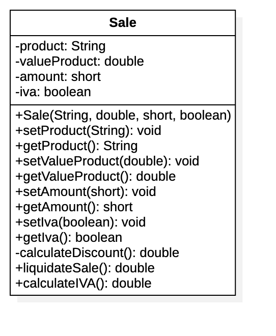

# MisionTIC

## Ejemplos de Aplicación de POO

### Implementación de clases

Se desea sistematizar el proceso de cálculo del valor total de una venta que tiene los siguientes ítems:

- Descripción del Producto
- Valor Unitario
- Cantidad Vendida
- IVA (Sí o No)

El siguiente Diagrama presenta la clase que generaliza las características de la venta

#### Descripción de miembros de la Clase

##### Atributos:

- __product__: Describe el nombre del producto de la venta
- __valueProduct__: Permite especificar el valor unitario del producto
- __amount__: Especifica la cantidad de la venta
- __iva__: Atributo que especifica si el producto cuenta o no con el impuesto de IVA, de tener el impuesto se aplica el 19% sobre el subtotal de la venta.

##### Métodos:

- __Sale__: Constructor que permite inicializar el valor de los atributos de la clase
- Métodos de Interfaz (get & set). Permiten inicializar y obtener los valores de los atributos
- __calculateDiscount__: Método privado que calcula el valor del descuento, el cual se debe aplicar sobre el valor del producto por la cantidad vendida (subtotal) teniendo en cuentas las siguientes condiciones:
  - Subtotal > 0 y menor o igual a 10K, aplica un descuento del 5%
  - subtotal > 10K y menor o igual a 20K, aplica un descuento del 10%
  - subtotal > 20K y menor o igual a 50K, aplica un descuento del 15%
  - subtotal > 50K y menor o igual a 100K, aplica un descuento del 20%
  - subtotal > 100K, aplica un descuento del 30%
- __liquidateSale__: Método público que calcula y retorna el valor de la venta, se tiene en cuenta el valor del subtotal (valor del producto por la cantidad vendida ) menos el descuento más el valor del cálculo del valor del IVA.
- __calculateIVA__: Método público que calcula y retorna el valor del cálculo del IVA. Se aplica sobre el valor del subtotal de la venta (valor del producto por la cantidad vendida ).

#### Actividades:

En un proyecto en Java Implemente la clase de la lógica del negocio (Sale), implemente una clase de aplicación que permita crear varias instancias de la clase `Sale` para realizar pruebas de los resultados obtenidos del llamado a los métodos de comportamiento respectivos.

### Diseño de Clases

Se requiere automatizar la gestión de créditos de una entidad financiera, las necesidades de información que se desean conocer son las siguientes:

- Un identificador del crédito
- El valor o monto del crédito
- La tasa de interés
- El plazo o número de cuotas
- El saldo del crédito.
- Fecha del crédito
- Un crédito se asocia con varios pagos de cuota.
- Al valor de cada cuota se debe restar el valor de los intereses, los cuales se calculan sobre el saldo del crédito.
- El valor del saldo del crédito se debe mantener actualizado con base en el pago de cuotas.

#### Actividades.

- Identificar los objetos que se encuentran en el Dominio del problema
- Especificar los objetos a través de un Diagrama de Clases que especifique el diseño de la solución.